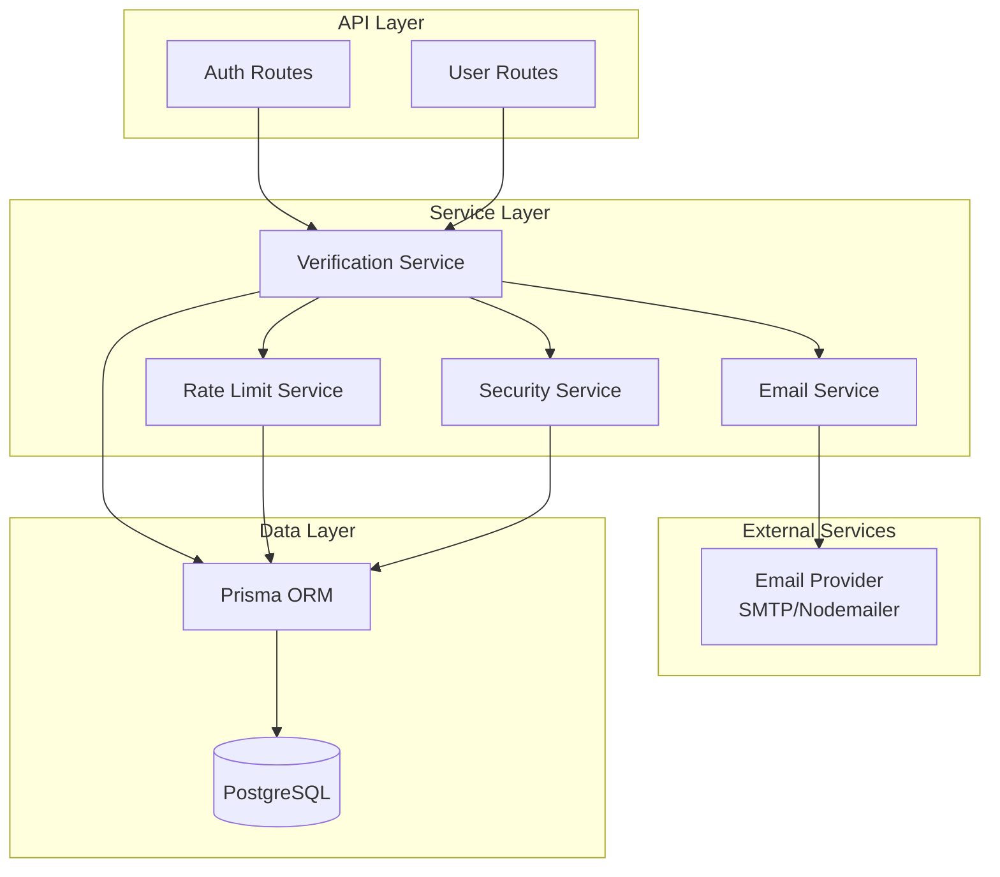
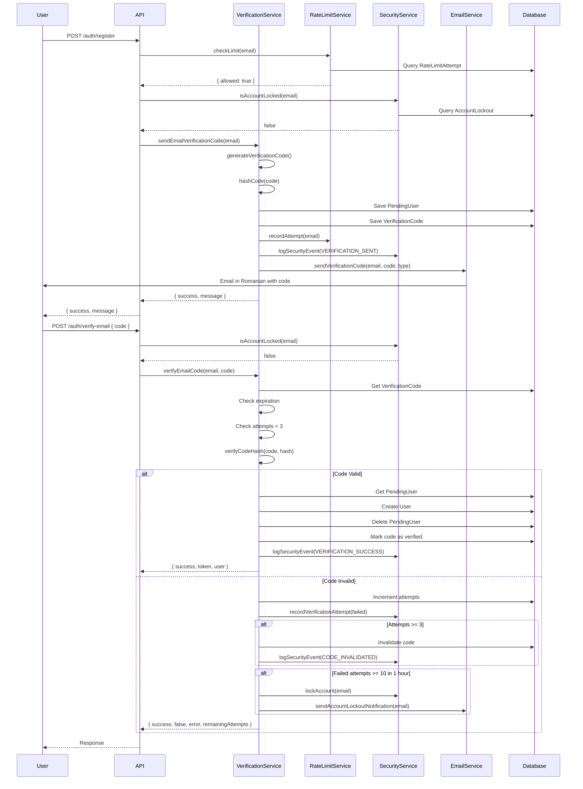
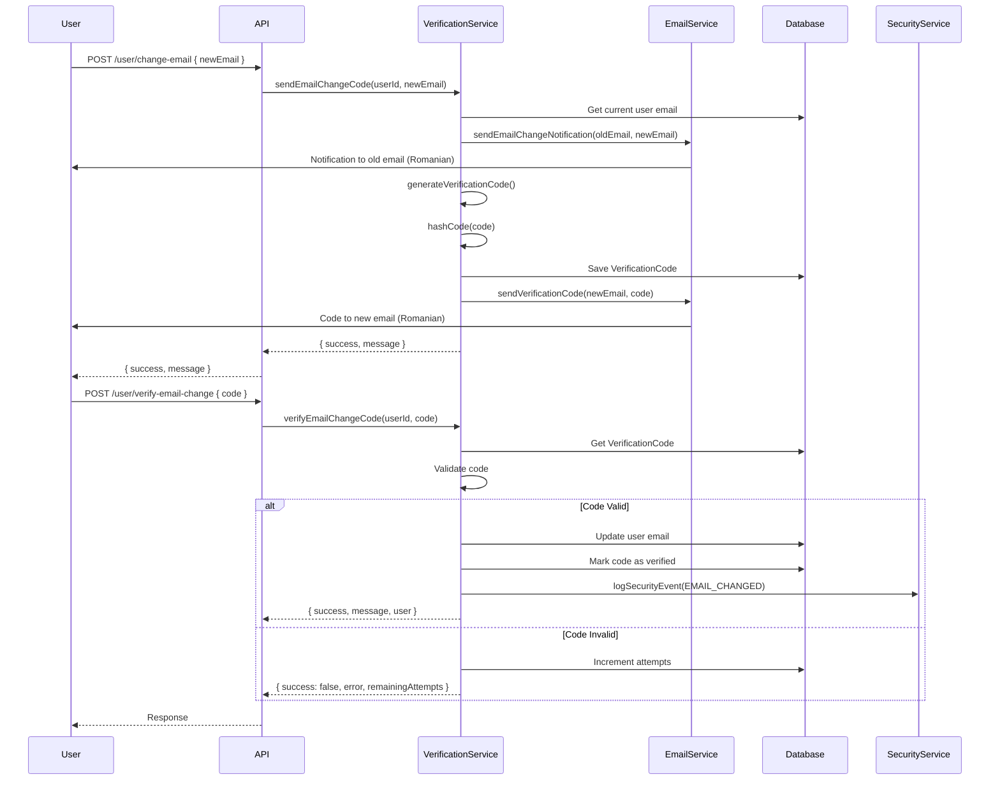
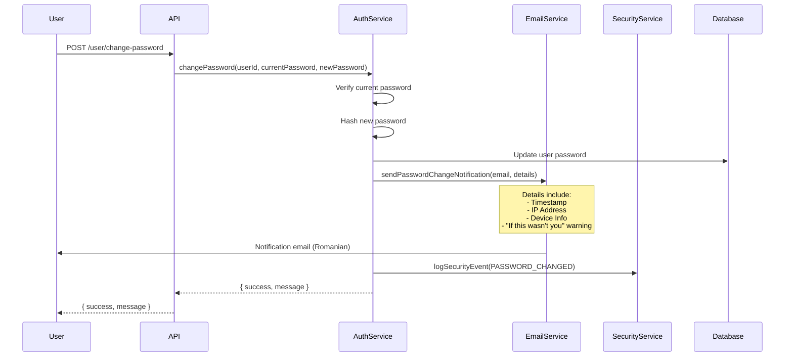

# Design Document: Email Verification and Notification System

## Overview

The email verification and notification system provides secure, time-limited verification codes for user registration, email changes, password change notifications, and phone number changes. All verification codes are sent via email (including phone number changes), with all communications in Romanian language. The system implements comprehensive security measures including code hashing, rate limiting (5 codes per hour), attempt tracking (3 attempts per code), and account lockout (10 failed attempts in 1 hour).

The design integrates with the existing backend email service and follows a service-oriented architecture with clear separation between verification logic, email communication, and storage. All verification codes are hashed before storage using bcrypt, and comprehensive security logging tracks all verification attempts and security events.

## Architecture

### High-Level Architecture



### Component Responsibilities

1. **Verification Service**: Core business logic for generating, validating, and managing verification codes
2. **Email Service**: Handles all email communication with Romanian templates
3. **Rate Limit Service**: Enforces rate limiting (5 codes per hour per user)
4. **Security Service**: Tracks failed attempts, manages account lockout (10 failures in 1 hour)
5. **API Routes**: HTTP endpoints for verification operations
6. **Data Layer**: Prisma models for storing verification codes, security logs, and rate limits

## Components and Interfaces

### 1. Verification Service

The central service that orchestrates all verification operations.

```typescript
interface VerificationService {
  // Email verification for registration
  sendEmailVerificationCode(email: string): Promise<VerificationResult>;
  verifyEmailCode(email: string, code: string): Promise<VerificationResult>;
  resendEmailCode(email: string): Promise<VerificationResult>;

  // Email change verification
  sendEmailChangeCode(
    userId: string,
    newEmail: string
  ): Promise<VerificationResult>;
  verifyEmailChangeCode(
    userId: string,
    code: string
  ): Promise<VerificationResult>;

  // Phone change verification (via email)
  sendPhoneChangeCode(
    userId: string,
    newPhone: string
  ): Promise<VerificationResult>;
  verifyPhoneChangeCode(
    userId: string,
    code: string
  ): Promise<VerificationResult>;

  // Utility methods
  generateVerificationCode(): string;
  hashCode(code: string): Promise<string>;
  verifyCodeHash(code: string, hash: string): Promise<boolean>;
  isCodeExpired(expiresAt: Date): boolean;
  invalidateCode(codeId: string): Promise<void>;
}

interface VerificationResult {
  success: boolean;
  message: string; // In Romanian
  data?: any;
  error?: string; // In Romanian
  remainingAttempts?: number;
  waitTimeMinutes?: number;
}

enum VerificationType {
  EMAIL_REGISTRATION = 'EMAIL_REGISTRATION',
  EMAIL_CHANGE = 'EMAIL_CHANGE',
  PHONE_CHANGE = 'PHONE_CHANGE',
}
```

### 2. Email Service

Handles all email communication using the existing backend email service with Romanian templates.

```typescript
interface EmailService {
  // Send verification code emails
  sendVerificationCode(
    to: string,
    code: string,
    type: EmailType
  ): Promise<EmailResult>;

  // Send notification emails
  sendEmailChangeNotification(
    to: string,
    newEmail: string
  ): Promise<EmailResult>;

  sendPasswordChangeNotification(
    to: string,
    details: PasswordChangeDetails
  ): Promise<EmailResult>;

  // Template rendering
  renderTemplate(templateName: string, data: any): string;
}

interface EmailResult {
  success: boolean;
  messageId?: string;
  error?: string; // In Romanian
}

interface PasswordChangeDetails {
  timestamp: Date;
  ipAddress: string;
  deviceInfo: string;
  userAgent?: string;
}

enum EmailType {
  REGISTRATION_VERIFICATION = 'REGISTRATION_VERIFICATION',
  EMAIL_CHANGE_VERIFICATION = 'EMAIL_CHANGE_VERIFICATION',
  EMAIL_CHANGE_NOTIFICATION = 'EMAIL_CHANGE_NOTIFICATION',
  PASSWORD_CHANGE_NOTIFICATION = 'PASSWORD_CHANGE_NOTIFICATION',
  PHONE_CHANGE_VERIFICATION = 'PHONE_CHANGE_VERIFICATION',
  ACCOUNT_LOCKOUT_NOTIFICATION = 'ACCOUNT_LOCKOUT_NOTIFICATION',
}
```

### 3. Rate Limit Service

Enforces rate limiting to prevent abuse (5 codes per hour per user).

```typescript
interface RateLimitService {
  // Check if rate limit is exceeded
  checkLimit(identifier: string): Promise<RateLimitResult>;

  // Record a code generation attempt
  recordAttempt(identifier: string): Promise<void>;

  // Get remaining wait time
  getRemainingWaitTime(identifier: string): Promise<number>;

  // Reset rate limit (for testing or admin override)
  resetLimit(identifier: string): Promise<void>;
}

interface RateLimitResult {
  allowed: boolean;
  remainingAttempts: number;
  resetTime?: Date;
  waitTimeMinutes?: number;
}
```

### 4. Security Service

Tracks failed attempts and manages account lockout.

```typescript
interface SecurityService {
  // Record verification attempt
  recordVerificationAttempt(
    identifier: string,
    type: VerificationType,
    success: boolean,
    ipAddress?: string
  ): Promise<void>;

  // Check if account is locked
  isAccountLocked(identifier: string): Promise<boolean>;

  // Get failed attempt count
  getFailedAttemptCount(
    identifier: string,
    windowHours: number
  ): Promise<number>;

  // Lock account
  lockAccount(identifier: string, reason: string): Promise<void>;

  // Unlock account (automatic after 1 hour)
  unlockAccount(identifier: string): Promise<void>;

  // Log security event
  logSecurityEvent(event: SecurityEvent): Promise<void>;
}

interface SecurityEvent {
  userId?: string;
  email?: string;
  eventType: SecurityEventType;
  ipAddress?: string;
  userAgent?: string;
  metadata?: any;
}

enum SecurityEventType {
  VERIFICATION_SENT = 'VERIFICATION_SENT',
  VERIFICATION_SUCCESS = 'VERIFICATION_SUCCESS',
  VERIFICATION_FAILED = 'VERIFICATION_FAILED',
  CODE_EXPIRED = 'CODE_EXPIRED',
  CODE_INVALIDATED = 'CODE_INVALIDATED',
  RATE_LIMIT_EXCEEDED = 'RATE_LIMIT_EXCEEDED',
  ACCOUNT_LOCKED = 'ACCOUNT_LOCKED',
  ACCOUNT_UNLOCKED = 'ACCOUNT_UNLOCKED',
  EMAIL_CHANGED = 'EMAIL_CHANGED',
  PASSWORD_CHANGED = 'PASSWORD_CHANGED',
  PHONE_CHANGED = 'PHONE_CHANGED',
}
```

### 5. API Routes

HTTP endpoints for verification operations.

```typescript
// Registration with email verification
POST /api/auth/register
Body: { email, password, name, phone? }
Response: { success, message, pendingUserId }

POST /api/auth/verify-email
Body: { email, code }
Response: { success, message, token?, user? }

POST /api/auth/resend-email-code
Body: { email }
Response: { success, message }

// Email change
POST /api/user/change-email
Headers: { Authorization: Bearer <token> }
Body: { newEmail }
Response: { success, message }

POST /api/user/verify-email-change
Headers: { Authorization: Bearer <token> }
Body: { code }
Response: { success, message, user? }

// Phone change (verification via email)
POST /api/user/change-phone
Headers: { Authorization: Bearer <token> }
Body: { newPhone }
Response: { success, message }

POST /api/user/verify-phone-change
Headers: { Authorization: Bearer <token> }
Body: { code }
Response: { success, message, user? }

POST /api/user/resend-phone-code
Headers: { Authorization: Bearer <token> }
Response: { success, message }

// Password change (triggers notification)
POST /api/user/change-password
Headers: { Authorization: Bearer <token> }
Body: { currentPassword, newPassword }
Response: { success, message }
```

## Data Models

### Prisma Schema Extensions

```prisma
// Verification codes table
model VerificationCode {
  id         String   @id @default(cuid())
  userId     String?  // Null for registration, set for changes
  email      String?  // For email verifications
  phone      String?  // For phone change verifications
  type       String   // EMAIL_REGISTRATION, EMAIL_CHANGE, PHONE_CHANGE
  codeHash   String   // Hashed verification code using bcrypt
  attempts   Int      @default(0) // Number of verification attempts
  maxAttempts Int     @default(3) // Maximum attempts allowed
  expiresAt  DateTime // 15 minutes from creation
  verified   Boolean  @default(false)
  verifiedAt DateTime?
  invalidated Boolean @default(false) // Manually invalidated
  createdAt  DateTime @default(now())
  updatedAt  DateTime @updatedAt

  @@index([userId])
  @@index([email])
  @@index([phone])
  @@index([type])
  @@index([expiresAt])
  @@index([verified])
  @@index([invalidated])
}

// Pending user registrations (not created until email verified)
model PendingUser {
  id        String   @id @default(cuid())
  email     String   @unique
  password  String   // Hashed password
  name      String
  phone     String?
  createdAt DateTime @default(now())
  expiresAt DateTime // Auto-delete after 24 hours

  @@index([email])
  @@index([expiresAt])
}

// Security event logging
model SecurityLog {
  id        String   @id @default(cuid())
  userId    String?
  email     String?
  phone     String?
  eventType String   // VERIFICATION_SENT, VERIFICATION_SUCCESS, VERIFICATION_FAILED, etc.
  ipAddress String?
  userAgent String?
  metadata  Json?    // Additional event data
  createdAt DateTime @default(now())

  @@index([userId])
  @@index([email])
  @@index([eventType])
  @@index([createdAt])
}

// Rate limiting tracking (5 codes per hour per user)
model RateLimitAttempt {
  id         String   @id @default(cuid())
  identifier String   // Email or user ID
  attempts   Int      @default(1)
  windowStart DateTime @default(now())
  expiresAt  DateTime // 1 hour from windowStart

  @@unique([identifier])
  @@index([identifier])
  @@index([expiresAt])
}

// Account lockout tracking (10 failed attempts in 1 hour)
model AccountLockout {
  id         String    @id @default(cuid())
  identifier String    @unique // Email or user ID
  reason     String    // Reason for lockout
  lockedAt   DateTime  @default(now())
  expiresAt  DateTime  // 1 hour from lockedAt
  unlocked   Boolean   @default(false)
  unlockedAt DateTime?

  @@index([identifier])
  @@index([expiresAt])
  @@index([unlocked])
}

// Add fields to existing User model
model User {
  // ... existing fields ...
  emailVerified    Boolean  @default(false)
  emailVerifiedAt  DateTime?
}
```

### Data Flow Diagrams

#### Email Registration Flow



#### Email Change Flow



#### Password Change Notification Flow



## Correctness Properties

_A property is a characteristic or behavior that should hold true across all valid executions of a system—essentially, a formal statement about what the system should do. Properties serve as the bridge between human-readable specifications and machine-verifiable correctness guarantees._

### Core Verification Properties

Property 1: Universal Code Generation
_For any_ verification request (registration, email change, or phone change), the generated verification code should be exactly 6 digits and composed entirely of numeric characters.
**Validates: Requirements 1.1, 2.2, 4.1**

Property 2: Code Hashing Before Storage
_For any_ generated verification code, the value stored in the database should be a hashed version (not equal to the plaintext code).
**Validates: Requirements 5.1**

Property 3: Hash-Based Validation
_For any_ verification attempt, the system should validate by comparing the hash of the provided code with the stored hash, not by comparing plaintext values.
**Validates: Requirements 1.3, 2.4, 4.3**

Property 4: Universal Code Expiration
_For any_ verification code, if more than 15 minutes have elapsed since creation, validation should fail regardless of whether the code is correct.
**Validates: Requirements 1.5, 2.6, 4.5**

Property 5: Code Resend Invalidation
_For any_ code resend request, the previous code for that user and verification type should be marked as invalidated, and a new code should be generated.
**Validates: Requirements 1.6, 4.7**

Property 6: Attempt Limiting
_For any_ verification code, after 3 failed validation attempts, the code should be marked as invalidated and all subsequent validation attempts should fail.
**Validates: Requirements 1.8, 2.8, 4.8**

Property 7: Registration Account Creation
_For any_ successful email verification during registration, a user account should be created and the pending user record should be removed.
**Validates: Requirements 1.4**

Property 8: Email Change Update
_For any_ successful email change verification, the user's email address should be updated to the new email address.
**Validates: Requirements 2.5**

Property 9: Phone Change Update
_For any_ successful phone change verification, the user's phone number should be updated to the new phone number.
**Validates: Requirements 4.4**

Property 10: Verified Code Reuse Prevention
_For any_ verification code that has been successfully used, subsequent validation attempts with the same code should fail.
**Validates: Requirements 5.5**

### Email and Notification Properties

Property 11: Verification Code Email Delivery
_For any_ generated verification code, an email containing the code should be sent to the appropriate email address (registration email, new email for changes, or current email for phone changes).
**Validates: Requirements 1.2, 2.3, 4.2**

Property 12: Email Change Notification
_For any_ email change request, a notification email should be sent to the current (old) email address before sending the verification code to the new email.
**Validates: Requirements 2.1**

Property 13: Password Change Notification
_For any_ password change, a notification email should be sent to the user's current email address.
**Validates: Requirements 3.1**

Property 14: Password Change Notification Content
_For any_ password change notification email, the content should include the timestamp, IP address, device information, and a warning message stating "If this wasn't you".
**Validates: Requirements 3.2, 3.3, 3.4, 3.5**

Property 15: Romanian Language Emails
_For any_ email sent by the system (verification codes, notifications, errors), the content should be in Romanian language.
**Validates: Requirements 8.3**

Property 16: Dual Format Email Support
_For any_ email sent by the system, both HTML and plain text versions should be provided.
**Validates: Requirements 8.6**

### Rate Limiting Properties

Property 17: Rate Limit Tracking
_For any_ verification code request, the rate limiter should increment the request count for that user identifier.
**Validates: Requirements 6.1**

Property 18: Rate Limit Enforcement
_For any_ user identifier, after 5 verification code requests within a 1-hour window, the 6th request should be rejected.
**Validates: Requirements 6.2**

Property 19: Rate Limit Error Messages
_For any_ rate limit rejection, the error message should be in Romanian and include the remaining wait time in minutes.
**Validates: Requirements 6.3, 10.5**

Property 20: Rate Limit Reset
_For any_ user identifier with rate limit restrictions, after 1 hour from the first request in the window, new code requests should be allowed.
**Validates: Requirements 6.4**

Property 21: Cross-Type Rate Limiting
_For any_ user identifier, the rate limit should apply across all verification types (registration, email change, phone change) combined, not separately per type.
**Validates: Requirements 6.5**

### Security and Lockout Properties

Property 22: Failed Attempt Logging
_For any_ failed verification attempt, a security log entry should be created containing the user identifier, timestamp, IP address, and event type.
**Validates: Requirements 7.1**

Property 23: Account Lockout Trigger
_For any_ user identifier, after 10 failed verification attempts within a 1-hour window, the account should be locked.
**Validates: Requirements 7.2**

Property 24: Lockout Verification Blocking
_For any_ locked account, all verification attempts should be rejected regardless of code correctness.
**Validates: Requirements 7.3**

Property 25: Lockout Notification
_For any_ account lockout event, a notification email should be sent to the user's email address in Romanian.
**Validates: Requirements 7.4**

Property 26: Automatic Lockout Expiration
_For any_ locked account, after 1 hour from the lockout time, the account should be automatically unlocked.
**Validates: Requirements 7.5**

Property 27: Lockout Event Logging
_For any_ account lockout or unlock event, a security log entry should be created containing the user identifier, timestamp, and reason.
**Validates: Requirements 7.6**

### Data Storage Properties

Property 28: Complete Code Storage
_For any_ stored verification code, the database record should contain user identifier, verification type, hashed code, expiration timestamp, attempt count, and verification status.
**Validates: Requirements 5.3, 9.1**

Property 29: Code Audit Trail
_For any_ verification code that has expired, the database record should be retained (not deleted) for audit purposes.
**Validates: Requirements 5.4**

Property 30: Code Query Support
_For any_ query by user identifier and verification type, the system should return all matching verification codes.
**Validates: Requirements 9.2**

Property 31: Comprehensive Security Logging
_For any_ security event (verification sent, success, failure, lockout), a log entry should be created in the security log.
**Validates: Requirements 9.3**

Property 32: Expired Code Cleanup
_For any_ verification code older than 24 hours, the system should automatically delete it during cleanup operations.
**Validates: Requirements 9.4**

### Error Handling Properties

Property 33: Success Message Localization
_For any_ successful verification code send operation, the response message should be in Romanian.
**Validates: Requirements 10.1**

Property 34: Send Failure Error Messages
_For any_ failed verification code send operation, the error message should be in Romanian and descriptive.
**Validates: Requirements 10.2**

Property 35: Invalid Code Error Messages
_For any_ invalid verification code attempt, the error message should be in Romanian and indicate the code is incorrect.
**Validates: Requirements 10.3**

Property 36: Expired Code Error Messages
_For any_ expired verification code attempt, the error message should be in Romanian and indicate the code has expired.
**Validates: Requirements 10.4**

Property 37: Lockout Error Messages
_For any_ verification attempt on a locked account, the error message should be in Romanian and indicate the account is locked.
**Validates: Requirements 10.6**

Property 38: Success Verification Messages
_For any_ successful verification, the response message should be in Romanian and include next steps.
**Validates: Requirements 10.7**

Property 39: Max Attempts Error Messages
_For any_ verification code that has exceeded maximum attempts, the error message should be in Romanian and indicate the code has been invalidated.
**Validates: Requirements 10.8**

## Error Handling

### Error Categories

1. **Validation Errors**
   - Invalid code format (not 6 digits)
   - Code not found
   - Code expired
   - Code already used
   - Code invalidated (max attempts exceeded)
   - Incorrect code

2. **Rate Limiting Errors**
   - Too many code requests (5 per hour exceeded)
   - Account locked (10 failed attempts in 1 hour)

3. **Email Delivery Errors**
   - Email service unavailable
   - Invalid email address
   - Email send failure

4. **Authentication Errors**
   - User not found
   - Invalid authentication token
   - Unauthorized access

### Error Response Format

All errors are returned in Romanian with consistent structure:

```typescript
interface ErrorResponse {
  success: false;
  error: string; // Romanian error message
  code: string; // Error code for client handling
  details?: {
    remainingAttempts?: number;
    waitTimeMinutes?: number;
    expiresAt?: string;
  };
}
```

### Error Messages (Romanian)

```typescript
const ERROR_MESSAGES = {
  // Validation errors
  INVALID_CODE_FORMAT: 'Codul de verificare trebuie să conțină exact 6 cifre.',
  CODE_NOT_FOUND: 'Codul de verificare nu a fost găsit.',
  CODE_EXPIRED:
    'Codul de verificare a expirat. Vă rugăm să solicitați un cod nou.',
  CODE_ALREADY_USED: 'Acest cod de verificare a fost deja utilizat.',
  CODE_INVALIDATED:
    'Codul de verificare a fost invalidat din cauza prea multor încercări eșuate.',
  INCORRECT_CODE:
    'Codul de verificare este incorect. Mai aveți {attempts} încercări.',

  // Rate limiting errors
  RATE_LIMIT_EXCEEDED:
    'Ați depășit limita de solicitări. Vă rugăm să așteptați {minutes} minute.',
  ACCOUNT_LOCKED:
    'Contul dvs. a fost blocat temporar din cauza prea multor încercări eșuate. Vă rugăm să așteptați 1 oră.',

  // Email errors
  EMAIL_SEND_FAILED:
    'Nu am putut trimite email-ul de verificare. Vă rugăm să încercați din nou.',
  INVALID_EMAIL: 'Adresa de email nu este validă.',
  EMAIL_SERVICE_UNAVAILABLE:
    'Serviciul de email este temporar indisponibil. Vă rugăm să încercați mai târziu.',

  // Authentication errors
  USER_NOT_FOUND: 'Utilizatorul nu a fost găsit.',
  INVALID_TOKEN: 'Token-ul de autentificare este invalid.',
  UNAUTHORIZED: 'Nu aveți permisiunea de a efectua această acțiune.',

  // Success messages
  CODE_SENT: 'Codul de verificare a fost trimis la adresa de email.',
  VERIFICATION_SUCCESS: 'Verificarea a fost realizată cu succes.',
  EMAIL_CHANGED: 'Adresa de email a fost schimbată cu succes.',
  PHONE_CHANGED: 'Numărul de telefon a fost schimbat cu succes.',
  PASSWORD_CHANGED:
    'Parola a fost schimbată cu succes. Un email de confirmare a fost trimis.',
};
```

### Error Handling Strategy

1. **Graceful Degradation**: If email service fails, store the code and allow manual retry
2. **Detailed Logging**: Log all errors with context for debugging
3. **User-Friendly Messages**: All error messages in Romanian, clear and actionable
4. **Security**: Don't reveal sensitive information in error messages
5. **Retry Logic**: Implement exponential backoff for email service failures

## Testing Strategy

### Dual Testing Approach

The testing strategy employs both unit tests and property-based tests to ensure comprehensive coverage:

- **Unit Tests**: Verify specific examples, edge cases, and error conditions
- **Property-Based Tests**: Verify universal properties across all inputs using randomized testing

Both approaches are complementary and necessary for comprehensive coverage. Unit tests catch concrete bugs in specific scenarios, while property tests verify general correctness across a wide range of inputs.

### Property-Based Testing Configuration

**Library Selection**: Use `fast-check` for TypeScript/JavaScript property-based testing

**Test Configuration**:

- Minimum 100 iterations per property test (due to randomization)
- Each property test must reference its design document property
- Tag format: `Feature: email-verification-notifications, Property {number}: {property_text}`

**Example Property Test Structure**:

```typescript
import fc from 'fast-check';

describe('Feature: email-verification-notifications', () => {
  describe('Property 1: Universal Code Generation', () => {
    it('should generate 6-digit numeric codes for all verification types', () => {
      // Feature: email-verification-notifications, Property 1: Universal Code Generation
      fc.assert(
        fc.property(
          fc.constantFrom('EMAIL_REGISTRATION', 'EMAIL_CHANGE', 'PHONE_CHANGE'),
          async (verificationType) => {
            const code = await verificationService.generateVerificationCode();

            // Code should be exactly 6 digits
            expect(code).toMatch(/^\d{6}$/);
            expect(code.length).toBe(6);
            expect(parseInt(code)).toBeGreaterThanOrEqual(0);
            expect(parseInt(code)).toBeLessThanOrEqual(999999);
          }
        ),
        { numRuns: 100 }
      );
    });
  });
});
```

### Unit Testing Focus

Unit tests should focus on:

1. **Specific Examples**:
   - Valid code verification succeeds
   - Invalid code verification fails
   - Expired code verification fails

2. **Edge Cases**:
   - Code with leading zeros (e.g., "000123")
   - Boundary conditions (exactly 15 minutes, exactly 3 attempts)
   - Empty or null inputs

3. **Error Conditions**:
   - Email service failures
   - Database connection errors
   - Invalid input formats

4. **Integration Points**:
   - Email service integration
   - Database operations
   - Rate limiter coordination

### Test Coverage Requirements

- **Code Coverage**: Minimum 80% line coverage
- **Property Coverage**: All 39 correctness properties must have corresponding property tests
- **Error Path Coverage**: All error conditions must be tested
- **Romanian Language**: All error messages and emails must be verified in Romanian

### Testing Tools

- **Unit Testing**: Jest
- **Property-Based Testing**: fast-check
- **Email Testing**: nodemailer-mock or similar
- **Database Testing**: In-memory PostgreSQL or test database
- **Code Coverage**: Istanbul/nyc

## Implementation Notes

### Security Considerations

1. **Code Hashing**: Use bcrypt with salt rounds of 10 for hashing verification codes
2. **Cryptographic Randomness**: Use `crypto.randomInt()` for code generation
3. **Timing Attack Prevention**: Use constant-time comparison for code validation
4. **SQL Injection Prevention**: Use Prisma parameterized queries
5. **XSS Prevention**: Sanitize all user inputs in email templates

### Performance Considerations

1. **Database Indexing**: Index verification codes by user ID, email, type, and expiration
2. **Code Cleanup**: Run automated cleanup job daily to remove codes older than 24 hours
3. **Rate Limit Caching**: Cache rate limit data in Redis for faster lookups
4. **Email Queue**: Use job queue (Bull/BullMQ) for asynchronous email sending
5. **Connection Pooling**: Use Prisma connection pooling for database efficiency

### Romanian Email Templates

All email templates must be professionally designed with:

- Company branding (logo, colors, fonts)
- Clear subject lines in Romanian
- Responsive HTML design
- Plain text fallback
- Proper Romanian diacritics (ă, â, î, ș, ț)
- Professional and courteous tone

**Template Examples**:

1. **Registration Verification**:
   - Subject: "Verificați adresa de email"
   - Content: Welcome message, verification code, expiration notice, instructions

2. **Email Change Notification**:
   - Subject: "Notificare: Schimbare adresă de email"
   - Content: Alert about email change request, new email address, security notice

3. **Email Change Verification**:
   - Subject: "Confirmați noua adresă de email"
   - Content: Verification code, expiration notice, instructions

4. **Password Change Notification**:
   - Subject: "Notificare: Parola a fost schimbată"
   - Content: Timestamp, IP address, device info, "If this wasn't you" warning, reset link

5. **Phone Change Verification**:
   - Subject: "Confirmați noul număr de telefon"
   - Content: Verification code, expiration notice, instructions

6. **Account Lockout Notification**:
   - Subject: "Cont blocat temporar"
   - Content: Lockout reason, duration, security advice, support contact

### Deployment Considerations

1. **Environment Variables**: Configure SMTP settings, rate limits, expiration times
2. **Database Migrations**: Use Prisma migrations for schema changes
3. **Monitoring**: Set up alerts for high failure rates, email delivery issues
4. **Logging**: Comprehensive logging with structured logs (JSON format)
5. **Backup**: Regular database backups including security logs

### Future Enhancements

1. **SMS Verification**: Add SMS verification as alternative to email
2. **Two-Factor Authentication**: Integrate with 2FA systems
3. **Biometric Verification**: Support for fingerprint/face recognition
4. **Multi-Language Support**: Add English and other languages
5. **Admin Dashboard**: View verification statistics, manage lockouts
6. **Webhook Notifications**: Real-time notifications for security events
